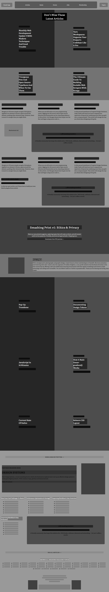

# Design-Teardown

This is a project of the Main HTML/CSS curriculum at Microverse - @microverseinc.

- The goal was to create a heat map of [this](https://www.smashingmagazine.com/) Smashing magazine page.
- The project was completed using simple html and css.

[Assignment link]()

Authors:

- [@MauricioRobayo](https://github.com/MauricioRobayo)
- [@BenjaminGarza](https://github.com/BenjaminGarza)

